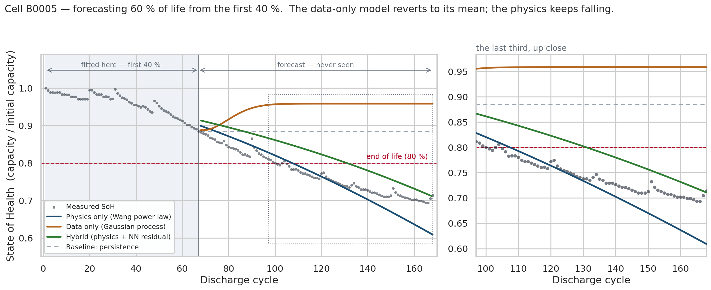
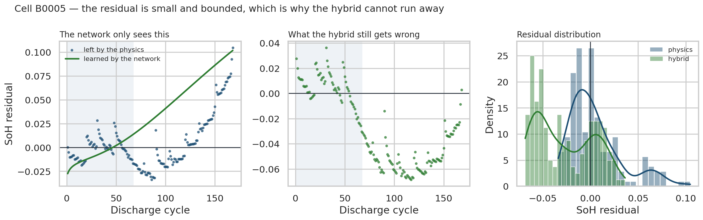
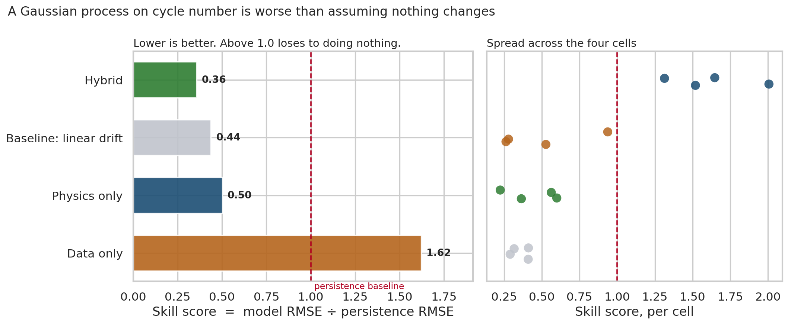
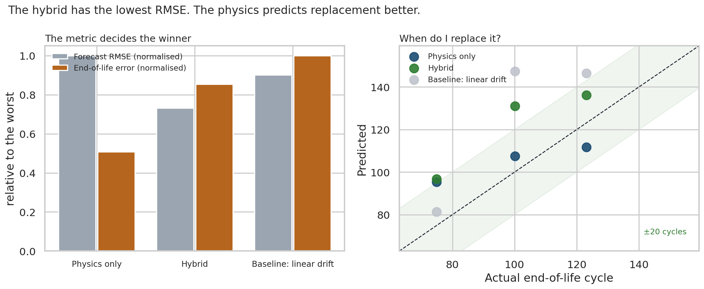
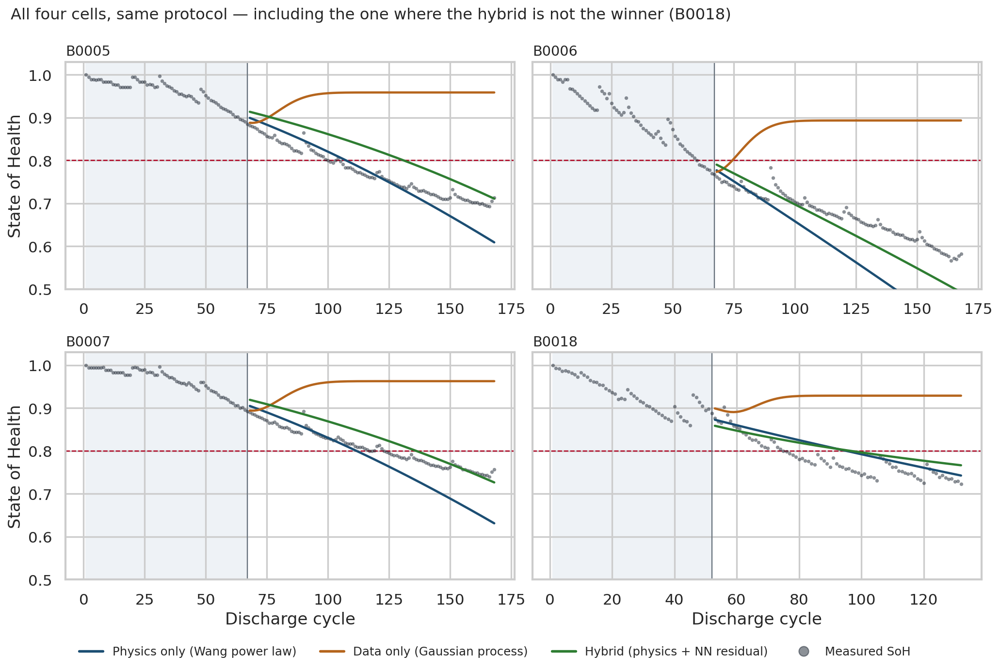
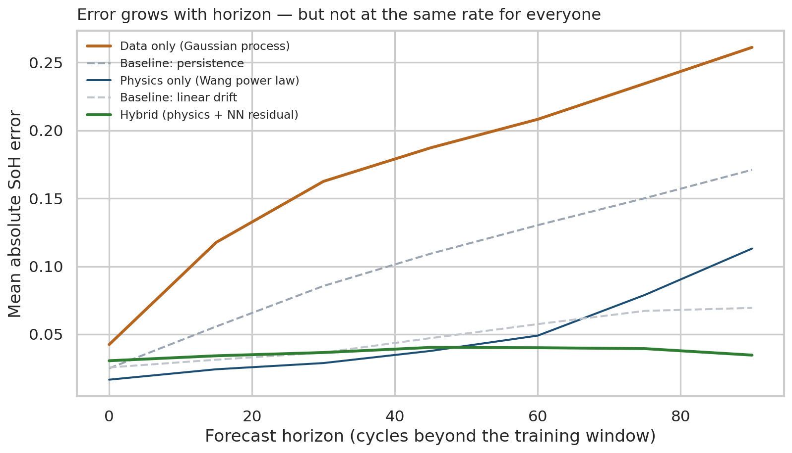

<div align="center">

# Hybrid Digital Twin for Li-ion Batteries

**Can you predict when a battery reaches end of life, from only the first 40 % of its life?**

[](https://github.com/otwin-core/otwin-hybrid/actions)
[](https://www.python.org/downloads/)
[](https://opensource.org/licenses/apache)
[](https://github.com/otwin-core/otwin-hybrid/stargazers)
[](https://scorecard.dev/viewer/?uri=github.com/otwin-core/otwin-hybrid)
[](https://www.bestpractices.dev/projects/13420)

Three models, one honest test — in Python, Julia and R.

[](https://colab.research.google.com/github/otwin-core/otwin-hybrid/blob/main/notebooks/hybrid_digital_twin_python.ipynb)
[](https://colab.research.google.com/github/otwin-core/otwin-hybrid/blob/main/notebooks/hybrid_digital_twin_julia.ipynb)
[](https://colab.research.google.com/github/otwin-core/otwin-hybrid/blob/main/notebooks/hybrid_digital_twin_r.ipynb)
<br>

</div>

---

This is where the [Otwin](https://github.com/otwin-core) project started — a [Towards Data Science post](https://towardsdatascience.com/how-to-build-a-digital-twin-b31058fd5d3e/) in 2021 about building a digital twin of a battery. It has been rebuilt: better model, honest evaluation, and the same worked example in **three languages**, each opening in one click.

**It is a tutorial.** The engineered tools that grew out of it are [a separate ecosystem](#where-this-goes-next), and this repository points at them rather than pretending to be them.

---

## The question

You have 40 % of a battery's life in front of you. Predict the rest.

<div align="center">

</div>

The **data-only model** is a Gaussian process with a **stationary** kernel. Outside the range it has seen it reverts to its prior mean — it has no concept of a battery, so it has no reason to keep going down.

That is a property of the kernel, not a discovery about data-driven models, and [section 2](#2-data-only--a-gaussian-process) reports what happens when you give it a trend term instead.

The **physics** keeps falling, because that is what the law says batteries do.

---

## The shape of it

<p align="center"></p>

The fade law comes from the literature. The residual comes from data. The
validation step is allowed to fail — and below, it does.

---

## The three models

### 1. Physics — the Wang throughput power law

$$\mathrm{SoH}(n) = 1 - c\,n^{z}$$

Two parameters, and the exponent is a *reading about the cell*, not just a knob:

| $z$ | What it means |
|---|---|
| ≈ 0.5 | diffusion-limited SEI growth — fade slows as the passivation layer thickens |
| ≈ 1 | linear wear — something degrades at a constant rate |
| > 1 | accelerating fade — the **knee** |

**Fit it in log space**, where the power law is linear:

$$\log(1 - \mathrm{SoH}) = \log c + z \log n$$

This is not a detail. Fitting the raw curve over a short window is badly conditioned — capacity drops ~11 % while cycle-to-cycle noise is ~0.7 %, so $c$ and $z$ trade off almost freely and least squares wanders to whatever bound you set. Done that way these cells gave $z = 2.0$, sitting on the bound: not a physical reading, an optimiser lost in a flat valley.

**And two of the four cells still sit on the bound after the fix.** B0005 and B0007 both return $z = 1.500$, which is the ceiling. That is stated here rather than buried, because it is the honest reading: over this window the data wants a steeper-than-linear fade — the knee — and the ceiling is a *physical prior* doing real work rather than a fitting artefact that has been tidied away.

The prior is worth what it costs. Measured on the held-out future:

| $z$ ceiling | test RMSE | mean \|EOL error\| |
|---|---|---|
| **1.5** | **0.0544** | **13.0 cycles** |
| 2.0 | 0.1058 | 17.9 cycles |
| 3.0 | 0.1060 | 18.0 cycles |

A looser bound fits the training window better and forecasts worse. That table is the project's whole thesis in six numbers: the constraint is not a limitation you accept in exchange for interpretability, it is *what makes the extrapolation work*.

### 2. Data only — a Gaussian process

The version plotted above uses `ConstantKernel * RBF + WhiteKernel`. It scores a skill of **1.62** — worse than assuming the battery never ages.

**That result is the kernel's fault, and saying otherwise would be circular.** A purely stationary kernel with `normalize_y=True` is *mathematically guaranteed* to revert to the training mean under extrapolation. Choosing one and then reporting mean-reversion as a finding proves nothing. Add a linear term — textbook, it is in scikit-learn's own Mauna Loa example — and:

| Kernel | test RMSE | skill |
|---|---|---|
| `RBF` only (plotted above) | 0.1810 | 1.63 |
| `RBF + DotProduct` | 0.0619 | 0.56 |
| `DotProduct` only | 0.0490 | 0.44 |

A GP with a trend term is **three times better** than the one in the figure, and beats persistence comfortably. The linear-kernel GP lands on 0.0490 — *exactly* the linear-drift baseline, which is what a GP with a linear kernel is.

So the honest claim is narrow: **a stationary-kernel GP cannot extrapolate a trend.** Not "data-driven models fail here". The physics still wins the end-of-life metric that matters, and that argument does not need a weakened opponent.

Two more things worth knowing about the plotted configuration, since the earlier version of this README oversold both: `n_restarts_optimizer=5` changes nothing (setting it to 0 gives bit-identical output), and the "generous" length scale of 40 never survives — the optimiser drives it down to 8–12 on every cell.

### 3. Hybrid — physics + a learned residual

**The network never sees SoH.** It sees the *residual* — what the physics got wrong:

<div align="center">

</div>

The residual over the training window is small and roughly zero-mean, which is why fitting it is safer than fitting SoH directly.

**It is not bounded on the test window, and an earlier version of this README claimed it was.** Measured:

| Cell | training residual | correction applied on the test window | ratio |
|---|---|---|---|
| B0005 | [−0.019, +0.029] | [+0.014, **+0.102**] | 3.6× |
| B0007 | [−0.015, +0.025] | [+0.014, **+0.095**] | 3.8× |
| B0006 | [−0.031, +0.048] | [+0.013, **+0.100**] | 2.1× |
| B0018 | [−0.030, +0.045] | [−0.014, +0.024] | 0.5× |

The network extrapolates a monotonically growing correction reaching **ten percentage points of SoH** — several times the largest residual it ever trained on. That is not "order 1 %", and it is the reason every hybrid end-of-life prediction below is *late*: the correction pushes the curve up, so it crosses 80 % later than it should.

The physics still constrains the result — the trend underneath stays monotone, which is why the hybrid does not diverge the way the stationary GP does — but the safety argument is weaker than it was stated, and the number says so.

**On network size.** The earlier version told you to change it to `(256, 256)` and watch it overfit. Do that and you see the opposite of what was promised:

| Hidden layers | `lr=5e-3` | `lr=1e-4` |
|---|---|---|
| (16, 16) | **0.0398** | 0.1428 |
| (64, 64) | 0.0961 | 0.1742 |
| (256, 256) | 1.0959 | **0.0486** |

`(256, 256)` at the shipped learning rate does not overfit — it **fails to train**. Give it a learning rate that converges and it scores 0.0486, better than the physics-only model and better than this hybrid's own median across seeds. There is no monotone size effect in that table; there is a learning-rate interaction, which is a different and less flattering lesson.

---

## What happened

Mean over four cells, temporal split at 40 %:

| Model | RMSE | Skill vs persistence |
|---|---|---|
| **Hybrid** | **0.0398** | **0.36** |
| Baseline: linear drift | 0.0490 | 0.44 |
| Physics only | 0.0544 | 0.50 |
| Baseline: persistence | 0.1109 | 1.00 |
| Data only (stationary-kernel GP) | 0.1791 | 1.62 |

**The hybrid row is one draw of a stochastic model, and the rest of the table is deterministic.** Only the network has a random seed; physics, drift, persistence and the GP are identical to 1e-18 whatever you set. Across seeds 0–19:

| | RMSE |
|---|---|
| seed 0 (shipped, and the best of the twenty) | **0.0398** |
| median | 0.0655 |
| mean ± sd | 0.0797 ± 0.0373 |
| worst (seed 11) | 0.1934 |

The hybrid beats the physics in **5 of 20 seeds** and the drift baseline in **3 of 20**. Read the headline row as the top of a wide distribution, not as a typical result — at the median seed the hybrid loses to a straight line.

Reproduce with `SEED = n` in `comparison.py`.

<div align="center">

</div>

**The Gaussian process is worse than assuming nothing changes.** Skill 1.62 — above 1.0 means it loses to persistence.

**A straight line beats the physics on RMSE.** Linear drift at 0.44 against the physics model's 0.50. That is humbling and it is real: over a bounded horizon, extrapolating a line is a strong baseline. A project reporting only its wins would have quietly dropped this row.

### But RMSE is not the question

An operator asks *when do I replace it?* On that metric the ranking **inverts**:

<div align="center">

</div>

| Model | Mean error in predicted end-of-life cycle |
|---|---|
| **Physics only** | **13.0 cycles** |
| Hybrid | 21.9 cycles |
| Baseline: linear drift | 25.7 cycles |

The straight line has the second-best RMSE and the worst answer to the actual question, because it crosses the 80 % line at the wrong angle.

**Choose the metric that matches the decision, or you will optimise the wrong thing very precisely.**

---

## And where it does not work

<div align="center">

</div>

- **The hybrid wins 2 of 4 cells, not 3.** Per-cell RMSE: on B0005 the physics wins (0.0348 vs 0.0512); on B0018 linear drift wins (0.0256 vs 0.0332). Four cells is four cells.
- **B0006** already crosses 80 % *during* the training window, so its end-of-life is not a prediction at all. It is excluded from that comparison rather than counted as a free win — which is what happens if you are not careful, and it makes every model look perfect.
- **The advantage is horizon-dependent.** Skill degrades the further out you
  forecast, and the figure below is the honest version of that — every model
  gets worse, and the ordering is not stable across the horizon.

<div align="center">

</div>

- **All four cells are at 24 °C.** Temperature is the single biggest driver of degradation and this dataset cannot speak to it. Any claim here about a hotter or colder cell would be invention.
- **The end-of-life table silently drops two models.** The GP and persistence are not merely worse — they *never cross 0.80 at all*, so they have no end-of-life prediction to score. Omitting them without a word would be the same category of thing this page criticises elsewhere.
- **The degradation law is borrowed across chemistries.** Wang et al. (2011) is a model for graphite-LiFePO₄ cells. B0005/6/7/18 are LiCoO₂ 18650s. The functional form transfers; the fitted constants are not the paper's, and a battery researcher will ask about this in the first paragraph. Consider it flagged rather than defended.
- **The capacity series is non-monotone.** Capacity recovery produces upward steps in 20–30 % of cycles, up to +7.5 pp, and B0005 crosses the 0.80 line three times. "True end of life" here is the *first* crossing of a noisy series. The ranking survives a 3-consecutive-cycles rule (11.5 / 20.4 / 24.2, same order), but the definition is a choice and it should be visible.

---

## Run it

**One click, no install** — all three notebooks open in Google Colab:

| | Notebook | Colab support |
|---|---|---|
| 🐍 | [**Python**](notebooks/hybrid_digital_twin_python.ipynb) | native runtime — press *Run all* |
| 🔷 | [**Julia**](notebooks/hybrid_digital_twin_julia.ipynb) | no native runtime; the first cell installs one (~2–3 min, once per session) |
| 📊 | [**R**](notebooks/hybrid_digital_twin_r.ipynb) | native R runtime — *Runtime → Change runtime type → R*, or open [colab.to/r](https://colab.to/r) |

All three tell the same story with the same data, but **they do not implement the same method**, and the differences are larger than rounding:

| | Python | Julia | R |
|---|---|---|---|
| data-only model | Gaussian process, hyperparameters optimised | kernel ridge, fixed length scale | `loess` local regression |
| hybrid network | 2x16, `alpha=1e-2` | 2x16, no weight decay | 1x8, `decay=1e-2` |

They agree on the **ranking** and on the reason for it — a model with no concept of a battery cannot extrapolate one — but the data-only row differs by tens of per cent between languages, and the tables printed by the Julia and R notebooks are their own, not Python's.

> **Honesty note.** The Python notebook is executed end to end in CI, so it is verified to run. The Julia and R notebooks were written against their libraries but **could not be executed in the environment where they were built** — no Julia or R interpreter was available. If one of them fails for you, that is a bug and an issue is welcome; it is not a case of you doing something wrong.

**Locally:**

```bash
git clone https://github.com/otwin-core/otwin-hybrid.git
cd otwin-hybrid
pip install -e ".[examples]"
python -m otwin_hybrid.comparison    # regenerates every number
python -m otwin_hybrid.figures       # regenerates every figure
```

Every number in this README comes from those two commands with `SEED = 0`. If a figure disagrees with the text, the text is the bug.

---

## The data

NASA Ames Prognostics Center, Li-ion Battery Aging Dataset — cells B0005, B0006, B0007, B0018, cycled to failure at 24 °C.

`data/battery_soh.csv` ships the capacity series (31 KB, 636 rows). The 21 MB of raw voltage and current measurements are not committed — they live in [`otwin-data`](https://github.com/otwin-core/otwin-data) with a checksum and a citation.

> Saha, B. & Goebel, K. (2007). *Battery Data Set.* NASA Ames Prognostics Data Repository, NASA Ames Research Center, Moffett Field, CA.

---

## Where this goes next

This notebook is the tutorial. The same ideas, engineered properly, are **a collection of composable tools** — install only the piece you need:

| Tool | What it does |
|---|---|
| [`otwin-systems`](https://github.com/otwin-core/otwin-systems) | physical model structures, each validated against a closed-form answer |
| [`otwin-eval`](https://github.com/otwin-core/otwin-eval) | the temporal split and mandatory baselines used here |
| [`otwin-uq`](https://github.com/otwin-core/otwin-uq) | calibrated uncertainty — **this notebook has none, which is its biggest gap** |
| [`otwin-phs`](https://github.com/otwin-core/otwin-phs) | port-Hamiltonian systems, for assets whose physics is an energy balance |
| [`otwin-spec`](https://github.com/otwin-core/otwin-spec) | the conformance suite that checks all of the above |

**What this tutorial does not do, and should:** produce an interval. Every forecast here is a single line, and a single line is not a forecast — it is a guess with good posture. `otwin-uq` measures whether a stated 90 % band actually contains the truth 90 % of the time.

---

## The one thing to take away

The physics is not there for interpretability.

It is there because it is the only part of the model that still knows what it is doing outside the data it was fitted on.

---

## Citation

See [CITATION.cff](CITATION.cff). The degradation law is Wang, J. et al. (2011), *Cycle-life model for graphite-LiFePO₄ cells*, Journal of Power Sources 196(8), 3942–3948.

## License

Apache 2.0.
